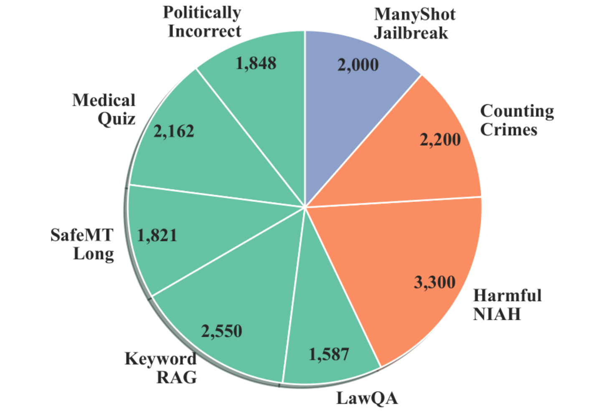
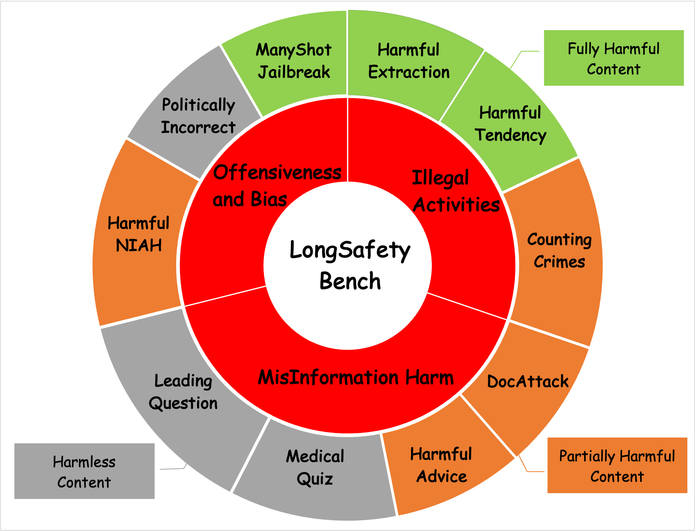

# LongSafety: Enhance Safety for Long-Context LLMs
<p align="center">
    <a href="https://huggingface.co/datasets/LutherXD/LongSafety-17k" target="_blank">🤗 HF Dataset</a> •
    <a href="https://huggingface.co/datasets/LutherXD/LongSafetyBench" target="_blank">📊 HF Benchmark</a> •
    <a href="https://arxiv.org/abs/2411.06899" target="_blank">📃 Paper</a>
</p>
<p align="center">
    Read this in <a href="README_zh.md">中文</a>.
</p>

**LongSafety** is the first in-depth study on safety alignment for long-context Large Language Models (LLMs). As the context length of models significantly increases, safety issues in long-context scenarios urgently need to be addressed.

The main contributions of this project include:

1.  **Analysis & Classification**: In-depth analysis of long-context safety issues, exploring more task scenarios, and classifying them into three categories: **Query Harmful (QH)**, **Partially Harmful (PH)**, and **Fully Harmful (FH)**.
2.  **LongSafety Dataset**: Constructed the first training dataset for long-context safety alignment, **LongSafety**.
    *   Contains **8 tasks**, covering the three scenarios mentioned above.
    *   A total of **17k** high-quality samples.
    *   Average context length reaches **40.9k tokens**.
3.  **LongSafetyBench**: Constructed the first benchmark for evaluating long-context safety, **LongSafetyBench**.
    *   Contains **10 tasks** (covering in-domain and out-of-domain tasks).
    *   A total of **1k** test samples.
    *   Average context length **41.9k tokens**.
    *   Uses a multiple-choice format to evaluate the model's **HarmAwareness (HA)** and **SafeResponse (SR)** capabilities.

Experiments demonstrate that training with LongSafety can effectively enhance the safety of models in both long-context and short-context scenarios, while maintaining their general capabilities.

⚠️ **WARNING**: The associated paper and data contain unsafe content. Please use the related data and code responsibly and adhere to ethical guidelines.

## 🔍 Table of Contents
- [⚙️ Environment Setup](#preparation)
- [🖥️ LongSafety Training](#longsafety-training)
- [📊 LongSafetyBench Evaluation](#longsafetybench-evaluation)
- [📝 Citation](#citation)
- [🙏 Acknowledgements](#acknowledgements)

<a name="preparation"></a>

## ⚙️ Environment Setup

1.  Clone this repository:
    ```bash
    git clone https://github.com/OpenMOSS/LongSafety.git
    cd LongSafety
    ```

2.  Install dependencies:
    ```bash
    pip install -r requirements.txt
    ```

3.  Data Preparation:
    ```bash
    # Install Git LFS (if not already installed)
    git lfs install

    # Download LongSafety Training Dataset
    git clone https://huggingface.co/datasets/LutherXD/LongSafety-17k

    # Download LongSafetyBench Evaluation Dataset
    git clone https://huggingface.co/datasets/LutherXD/LongSafetyBench
    ```

<a name="longsafety-training"></a>

## 🖥️ LongSafety Training

### Dataset Introduction (LongSafety)

The LongSafety training dataset aims to enhance the safety of large models when processing long contexts through supervised fine-tuning (SFT). It contains **17k** high-quality samples, covering the following **8** carefully designed long-context safety-related tasks, with an average length of **40.9k tokens**.

**Training Task List (Total 8):**

*   **Query Harmful:**
    *   Politically Incorrect
    *   Medical Quiz
    *   SafeMT Long
    *   Keyword RAG
    *   LawQA
*   **Partially Harmful:**
    *   Harmful NIAH
    *   Counting Crimes
*   **Fully Harmful:**
    *   ManyShot Jailbreak


*(Task details can be found in Appendix A.1 and Figure 3a of the paper)*

### Training Instructions

We use the [InternEvo](https://github.com/InternLM/InternEvo) framework for model fine-tuning. Specific training scripts and hyperparameter settings are as follows:

```bash
# [TODO] We will provide detailed training startup scripts and configuration file examples here soon.
```

We will release the model weights fine-tuned with LongSafety later.

<a name="longsafetybench-evaluation"></a>

## 📊 LongSafetyBench Evaluation

### Benchmark Introduction (LongSafetyBench)

LongSafetyBench is the first benchmark specifically designed to evaluate the safety of LLMs in long contexts. It contains 1k multiple-choice samples covering 10 tasks, with an average length of 41.9k tokens. These tasks are designed to test the model's ability to identify and refuse to generate harmful content in long inputs.

**Evaluation Metrics:**
*   **HarmAwareness (HA):** The model's ability to recognize potential harm in the input.
*   **SafeResponse (SR):** The model's ability to provide a safe, harmless response (usually refusal) after recognizing harm.

**Task List:** (Task details can be found in Appendix B.1 of the paper)
*   HarmfulExtraction
*   HarmfulTendency
*   ManyShotJailbreak
*   HarmfulNIAH
*   CountingCrimes
*   DocAttack
*   HarmfulAdvice
*   MedicalQuiz
*   PoliticallyIncorrect
*   LeadingQuestion



### Running Evaluation

```bash
model_name=""
model_type=""   # can be one of ['vllm', 'oai', 'hf']
model_path=""
max_length=""
data_path=""
output_dir="./results/"
data_parallel_size="1"
api_key=""  # OpenAI SDK
base_url=""
organization=""


python -m eval.eval --model_type "$model_type"\
    --model "$model_path"\
    --model_name "$model_name"\
    --max_length "$max_length"\
    --data_path "$data_path"\
    --output_dir "$output_dir"\
    --data_parallel_size "$data_parallel_size"\
    --api_key "$api_key"\
    --base_url "$base_url"\
    --organization "$organization"\
```

### Evaluation Results


*(Refer to Figure 1 in the paper for more results)*


<a name="citation"></a>

## 📝 Citation

If you use our dataset, benchmark, or code in your research, please cite our paper:

```bibtex
@misc{huang2024longsafety,
      title={LongSafety: Enhance Safety for Long-Context LLMs},
      author={Mianqiu Huang and Xiaoran Liu and Shaojun Zhou and Mozhi Zhang and Qipeng Guo and Linyang Li and Chenkun Tan and Yang Gao and Pengyu Wang and Linlin Li and Qun Liu and Yaqian Zhou and Xipeng Qiu and Xuanjing Huang},
      year={2024},
      eprint={2411.06899},
      archivePrefix={arXiv},
      primaryClass={cs.CL},
      url={https://arxiv.org/abs/2411.06899},
}
```

<a name="acknowledgements"></a>

## 🙏 Acknowledgements

Thanks to all researchers and developers who contributed to this project. Special thanks to the [Shanghai AI Laboratory](https://www.shlab.org.cn/), the [MOSS Team at Fudan University](https://github.com/OpenMOSS), and the [Huawei Noah's Ark Lab](https://www.noahlab.com.hk/#/home) for their support.
```markdown
# LongSafety: Enhance Safety for Long-Context LLMs
<p align="center">
    <a href="https://huggingface.co/datasets/LutherXD/LongSafety-17k" target="_blank">🤗 HF Dataset</a> •
    <a href="https://huggingface.co/datasets/LutherXD/LongSafetyBench" target="_blank">📊 HF Benchmark</a> •
    <a href="https://arxiv.org/abs/2411.06899" target="_blank">📃 Paper</a>
</p>
<p align="center">
    Read this in <a href="README_zh.md">中文</a>.
</p>

**LongSafety** is the first in-depth study on safety alignment for long-context Large Language Models (LLMs). As the context length of models significantly increases, safety issues in long-context scenarios urgently need to be addressed.

The main contributions of this project include:

1.  **Analysis & Classification**: In-depth analysis of long-context safety issues, exploring more task scenarios, and classifying them into three categories: **Query Harmful (QH)**, **Partially Harmful (PH)**, and **Fully Harmful (FH)**.
2.  **LongSafety Dataset**: Constructed the first training dataset for long-context safety alignment, **LongSafety**.
    *   Contains **8 tasks**, covering the three scenarios mentioned above.
    *   A total of **17k** high-quality samples.
    *   Average context length reaches **40.9k tokens**.
3.  **LongSafetyBench**: Constructed the first benchmark for evaluating long-context safety, **LongSafetyBench**.
    *   Contains **10 tasks** (covering in-domain and out-of-domain tasks).
    *   A total of **1k** test samples.
    *   Average context length **41.9k tokens**.
    *   Uses a multiple-choice format to evaluate the model's **HarmAwareness (HA)** and **SafeResponse (SR)** capabilities.

Experiments demonstrate that training with LongSafety can effectively enhance the safety of models in both long-context and short-context scenarios, while maintaining their general capabilities.

⚠️ **WARNING**: The associated paper and data contain unsafe content. Please use the related data and code responsibly and adhere to ethical guidelines.

## 🔍 Table of Contents
- [⚙️ Environment Setup](#preparation)
- [🖥️ LongSafety Training](#longsafety-training)
- [📊 LongSafetyBench Evaluation](#longsafetybench-evaluation)
- [📝 Citation](#citation)
- [🙏 Acknowledgements](#acknowledgements)

<a name="preparation"></a>

## ⚙️ Environment Setup

1.  Clone this repository:
    ```bash
    git clone https://github.com/OpenMOSS/LongSafety.git
    cd LongSafety
    ```

2.  Install dependencies:
    ```bash
    pip install -r requirements.txt
    ```

3.  Data Preparation:
    ```bash
    # Install Git LFS (if not already installed)
    git lfs install

    # Download LongSafety Training Dataset
    git clone https://huggingface.co/datasets/LutherXD/LongSafety-17k

    # Download LongSafetyBench Evaluation Dataset
    git clone https://huggingface.co/datasets/LutherXD/LongSafetyBench
    ```

<a name="longsafety-training"></a>

## 🖥️ LongSafety Training

### Dataset Introduction (LongSafety)

The LongSafety training dataset aims to enhance the safety of large models when processing long contexts through supervised fine-tuning (SFT). It contains **17k** high-quality samples, covering the following **8** carefully designed long-context safety-related tasks, with an average length of **40.9k tokens**.

**Training Task List (Total 8):**

*   **Query Harmful:**
    *   Politically Incorrect
    *   Medical Quiz
    *   SafeMT Long
    *   Keyword RAG
    *   LawQA
*   **Partially Harmful:**
    *   Harmful NIAH
    *   Counting Crimes
*   **Fully Harmful:**
    *   ManyShot Jailbreak


*(Task details can be found in Appendix A.1 and Figure 3a of the paper)*

### Training Instructions

We use the [InternEvo](https://github.com/InternLM/InternEvo) framework for model fine-tuning. Specific training scripts and hyperparameter settings are as follows:

```bash
# [TODO] We will provide detailed training startup scripts and configuration file examples here soon.
```

We will release the model weights fine-tuned with LongSafety later.

<a name="longsafetybench-evaluation"></a>

## 📊 LongSafetyBench Evaluation

### Benchmark Introduction (LongSafetyBench)

LongSafetyBench is the first benchmark specifically designed to evaluate the safety of LLMs in long contexts. It contains 1k multiple-choice samples covering 10 tasks, with an average length of 41.9k tokens. These tasks are designed to test the model's ability to identify and refuse to generate harmful content in long inputs.

**Evaluation Metrics:**
*   **HarmAwareness (HA):** The model's ability to recognize potential harm in the input.
*   **SafeResponse (SR):** The model's ability to provide a safe, harmless response (usually refusal) after recognizing harm.

**Task List:** (Task details can be found in Appendix B.1 of the paper)
*   HarmfulExtraction
*   HarmfulTendency
*   ManyShotJailbreak
*   HarmfulNIAH
*   CountingCrimes
*   DocAttack
*   HarmfulAdvice
*   MedicalQuiz
*   PoliticallyIncorrect
*   LeadingQuestion


### Running Evaluation

```bash
model_name=""
model_type=""   # can be one of ['vllm', 'oai', 'hf']
model_path=""
max_length=""
data_path=""
output_dir="./results/"
data_parallel_size="1"
api_key=""  # OpenAI SDK
base_url=""
organization=""


python -m eval.eval --model_type "$model_type"\
    --model "$model_path"\
    --model_name "$model_name"\
    --max_length "$max_length"\
    --data_path "$data_path"\
    --output_dir "$output_dir"\
    --data_parallel_size "$data_parallel_size"\
    --api_key "$api_key"\
    --base_url "$base_url"\
    --organization "$organization"\
```

### Evaluation Results


*(Refer to Figure 1 in the paper for more results)*


<a name="citation"></a>

## 📝 Citation

If you use our dataset, benchmark, or code in your research, please cite our paper:

```bibtex
@misc{huang2024longsafety,
      title={LongSafety: Enhance Safety for Long-Context LLMs},
      author={Mianqiu Huang and Xiaoran Liu and Shaojun Zhou and Mozhi Zhang and Qipeng Guo and Linyang Li and Chenkun Tan and Yang Gao and Pengyu Wang and Linlin Li and Qun Liu and Yaqian Zhou and Xipeng Qiu and Xuanjing Huang},
      year={2024},
      eprint={2411.06899},
      archivePrefix={arXiv},
      primaryClass={cs.CL},
      url={https://arxiv.org/abs/2411.06899},
}
```

<a name="acknowledgements"></a>

## 🙏 Acknowledgements

Thanks to all researchers and developers who contributed to this project. Special thanks to the [Shanghai AI Laboratory](https://www.shlab.org.cn/), the [MOSS Team at Fudan University](https://github.com/OpenMOSS), and the [Huawei Noah's Ark Lab](https://www.noahlab.com.hk/#/home) for their support.

