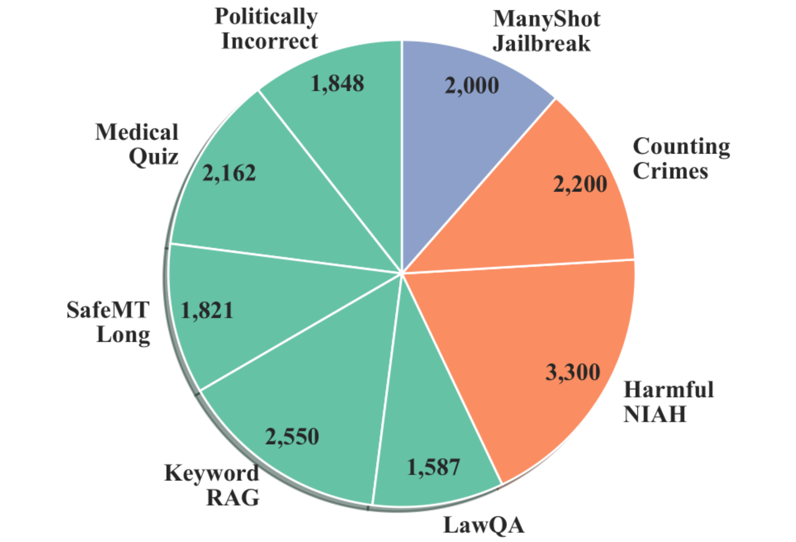
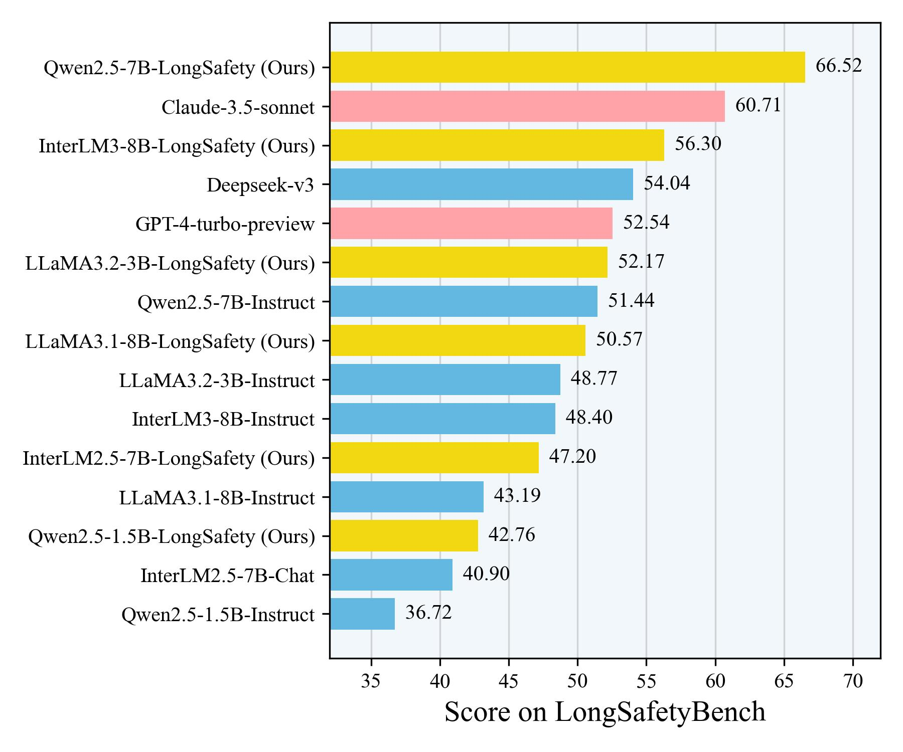

# LongSafety: Enhance Safety for Long-Context LLMs
<p align="center">
    <a href="https://huggingface.co/datasets/LutherXD/LongSafety-17k" target="_blank">🤗 HF 数据集</a> • 
    <a href="https://huggingface.co/datasets/LutherXD/LongSafetyBench" target="_blank">📊 HF 评测集</a> • 
    <a href="https://arxiv.org/abs/2411.06899" target="_blank">📃 论文</a>
</p>
<p align="center">
    Read this in <a href="README.md">English</a>.
</p>


**LongSafety** 是首个针对长文本大语言模型（LLM）安全对齐的深入研究。随着模型上下文长度的显著增加，长文本场景下的安全问题亟待解决。

本项目的主要贡献包括：

1.  **分析与分类**：深入分析了长文本安全问题，探索了更多任务场景，并将它们分为三类：**查询有害 (Query Harmful, QH)**、**部分有害 (Partially Harmful, PH)** 和 **完全有害 (Fully Harmful, FH)**。
2.  **LongSafety 数据集**：构建了首个用于长文本安全对齐的训练数据集 **LongSafety**。
    *   包含 **8个任务**，覆盖上述三种场景。
    *   共 **17k** 条高质量样本。
    *   平均上下文长度达到 **40.9k tokens**。
3.  **LongSafetyBench**：构建了首个用于评估长文本安全的基准测试 **LongSafetyBench**。
    *   包含 **10个任务** (涵盖域内和域外任务)。
    *   共 **1k** 条测试样本。
    *   平均上下文长度 **41.9k tokens**。
    *   采用多项选择题格式，评估模型的**危害意识 (HarmAwareness, HA)** 和 **安全响应 (SafeResponse, SR)** 能力。

实验证明，使用 LongSafety 进行训练可以有效提升模型在长文本和短文本场景下的安全性，同时保持其通用能力。

⚠️ **警告**：本项目相关论文和数据包含不安全内容。请在负责任的前提下使用相关数据和代码，遵守道德规范。

## 🔍 目录
- [⚙️ 环境准备](#preparation)
- [🖥️ LongSafety训练](#longsafety-training)
- [📊 LongSafetyBench评测](#longsafetybench-evaluation)
- [📝 引用](#citation)
- [🙏 致谢](#acknowledgements)

<a name="preparation"></a>

## ⚙️ 环境准备

1.  克隆本仓库：
    ```bash
    git clone https://github.com/OpenMOSS/LongSafety.git
    cd LongSafety
    ```

2.  安装依赖：
    ```bash
    pip install -r requirements.txt
    ```

3.  数据准备：
    ```bash
    # 安装 Git LFS (如果尚未安装)
    git lfs install

    # 下载 LongSafety 训练数据集
    git clone https://huggingface.co/datasets/LutherXD/LongSafety-17k

    # 下载 LongSafetyBench 评测数据集
    git clone https://huggingface.co/datasets/LutherXD/LongSafetyBench
    ```
 

<a name="longsafety-training"></a>

## 🖥️ LongSafety训练


### 数据集介绍 (LongSafety)

LongSafety 训练数据集旨在通过监督微调（SFT）提升大模型在处理长文本时的安全性。它包含 **17k** 条高质量样本，覆盖了以下 **8 种**精心设计的长文本安全相关任务，平均长度为 **40.9k tokens**。

**训练任务列表 (共 8 个):**

*   **Query Harmful (查询有害):**
    *   Politically Incorrect
    *   Medical Quiz
    *   SafeMT Long
    *   Keyword RAG
    *   LawQA
*   **Partially Harmful (部分有害):**
    *   Harmful NIAH
    *   Counting Crimes
*   **Fully Harmful (完全有害):**
    *   ManyShot Jailbreak




### 训练指令

我们使用 [InternEvo](https://github.com/InternLM/InternEvo) 框架进行模型微调。具体的训练脚本和超参数设置如下：

```bash

```

我们后续会发布使用 LongSafety 微调后的模型权重。

<a name="longsafetybench-evaluation"></a>

## 📊 LongSafetyBench评测

### 评测集介绍 (LongSafetyBench)

LongSafetyBench 是首个专门为评估 LLM 长文本安全设计的基准。它包含 1k 条多项选择题样本，涵盖 10 个任务，平均长度 41.9k tokens。这些任务旨在测试模型在长输入下识别和拒绝生成有害内容的能力。

**评测指标:**
*   **危害意识 (HarmAwareness, HA):** 模型识别输入中潜在危害的能力。
*   **安全响应 (SafeResponse, SR):** 模型在识别危害后给出安全、无害回复的能力（通常是拒绝）。

**任务列表：** (具体任务细节请参考论文附录 B.1)
*   HarmfulExtraction
*   HarmfulTendency
*   ManyShotJailbreak
*   HarmfulNIAH
*   CountingCrimes
*   DocAttack
*   HarmfulAdvice
*   MedicalQuiz
*   PoliticallyIncorrect
*   LeadingQuestion


### 运行评测


```bash
model_name=""
model_type=""   # can be one of ['vllm', 'oai', 'hf']
model_path=""
max_length=""
data_path=""
output_dir="./results/"
data_parallel_size="1"
api_key=""  # OpenAI SDK
base_url=""
organization=""


python -m eval.eval --model_type "$model_type"\
    --model "$model_path"\
    --model_name "$model_name"\
    --max_length "$max_length"\
    --data_path "$data_path"\
    --output_dir "$output_dir"\
    --data_parallel_size "$data_parallel_size"\
    --api_key "$api_key"\
    --base_url "$base_url"\
    --organization "$organization"\
```

### 评测结果




<a name="citation"></a>

## 📝 引用

如果您在研究中使用了我们的数据集、评测基准或代码，请引用我们的论文：

```bibtex
@misc{huang2024longsafety,
      title={LongSafety: Enhance Safety for Long-Context LLMs}, 
      author={Mianqiu Huang and Xiaoran Liu and Shaojun Zhou and Mozhi Zhang and Qipeng Guo and Linyang Li and Chenkun Tan and Yang Gao and Pengyu Wang and Linlin Li and Qun Liu and Yaqian Zhou and Xipeng Qiu and Xuanjing Huang},
      year={2024},
      eprint={2411.06899},
      archivePrefix={arXiv},
      primaryClass={cs.CL},
      url={https://arxiv.org/abs/2411.06899}, 
}
```

<a name="acknowledgements"></a>

## 🙏 致谢

感谢所有对本项目做出贡献的研究人员和开发者。特别感谢[复旦大学 MOSS 团队](https://github.com/OpenMOSS)、[华为诺亚方舟实验室](https://www.noahlab.com.hk/#/home)以及[上海人工智能实验室](https://www.shlab.org.cn/)的支持。

